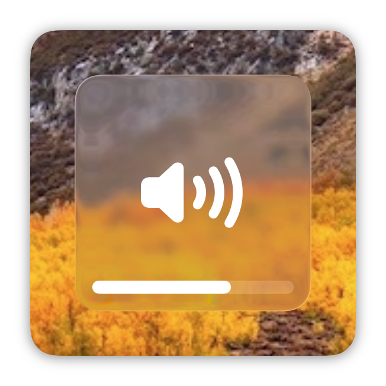
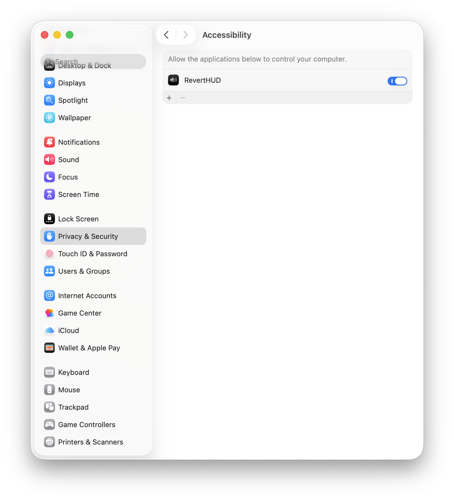

> [!NOTE]
> This was made a while ago and I'm releasing it only now.
> There might be a better app for this already, but I thought I should
> release this because I don't know why I never did lol

# RevertHUD
Bring back the pre-tahoe volume HUD

	<picture>
		<source media="(prefers-color-scheme: light)" srcset=".github/images/HudLight.png">
		<source media="(prefers-color-scheme: dark)" srcset=".github/images/HudDark.png">
		
	</picture>

## Usage
[Get the latest release](https://github.com/paigely/RevertHUD/releases/latest), unzip it, and then drag and drop RevertHUD.app into [accessibility settings (click to go there)](x-apple.systempreferences:com.apple.preference.security?Privacy_Accessibility)

Your settings should look like this:

	<picture>
		<source media="(prefers-color-scheme: light)" srcset=".github/images/AccessibilityLight.png">
		<source media="(prefers-color-scheme: dark)" srcset=".github/images/AccessibilityDark.png">
		
	</picture>

## Contributing
Contributions are welcome! No AI code please. If you have SIP off, and
homebrew installed, [tccutil.py](https://github.com/jacobsalmela/tccutil)
should be installed automatically and RevertHUD should gain accessibility
permissions to make debugging easier but I haven't tested this

## Credits
* [This comment](https://github.com/vincentneo/LosslessSwitcher/discussions/72#discussioncomment-8594625)
* [Artemisia](https://github.com/NSAntoine/Artemisia) for the original basis of this project (but I've since rewritten everything in Swift)
* [nekohaxx](https://github.com/nekohaxx) and [llsc12](https://github.com/llsc12) for some feedback
